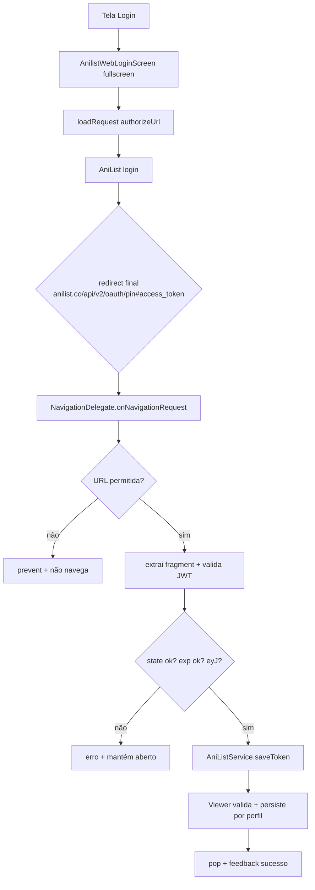
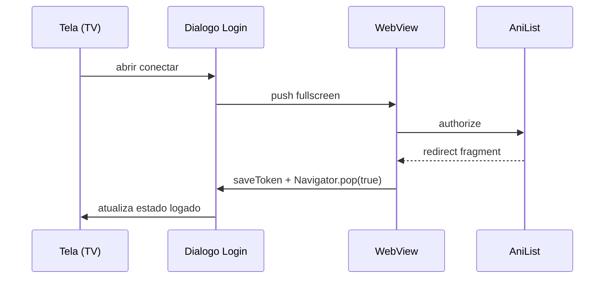

# Integração AniList ao GoAnime TV — Plano de Implementação

> **Documento de arquitetura** · Flutter / Android TV
> Autor: arquitetura GoAnime TV · Versão 1.0
>
> Este documento detalha a implementação do login OAuth 2.0 **Implicit Grant** do
> AniList dentro do GoAnime TV, partindo do código-fonte atual do repositório e
> reconciliando o fluxo canônico com o que já existe em `lib/core/anilist/`.

---

## Sumário

- [0. Estado atual do código e decisão de arquitetura](#0-estado-atual-do-código-e-decisão-de-arquitetura)
- [1. Fase 1 — Preparação](#1-fase-1--preparação)
- [2. Fase 2 — WebView](#2-fase-2--webview)
- [3. Fase 3 — Interceptação da URL](#3-fase-3--interceptação-da-url)
- [4. Fase 4 — Extração e validação do token](#4-fase-4--extração-e-validação-do-token)
- [5. Fase 5 — Persistência](#5-fase-5--persistência)
- [6. Fase 6 — Integração GraphQL](#6-fase-6--integração-graphql)
- [7. Fase 7 — Tratamento de erros](#7-fase-7--tratamento-de-erros)
- [8. Fase 8 — UX para TV](#8-fase-8--ux-para-tv)
- [9. Fase 9 — Segurança](#9-fase-9--segurança)
- [10. Fase 10 — Checklist de testes](#10-fase-10--checklist-de-testes)

---

## 0. Estado atual do código e decisão de arquitetura

### 0.1 O que já existe no repositório

O projeto já contém 80% do fluxo de autenticação implementado. Antes de propor,
é obrigatório mapear o que existe para não duplicar nem romper só original:

| Componente | Arquivo | Responsabilidade |
|---|---|---|
| `AppConstants` | `lib/core/constants/app_constants.dart` | `anilistClientId = '46975'`, `anilistApi`, `requestTimeout = 30s` · *legado a remover:* `anilistRedirectUri = 'http://127.0.0.1:8090/callback'` |
| `AnilistAuthService` | `lib/core/anilist/anilist_auth_service.dart` | Persistência **global** do token e usuário em `SharedPreferences` |
| `AniListService` | `lib/core/anilist/anilist_service.dart` | Cliente GraphQL (Bearer), `authUrl`, `saveToken`, `refreshUser`, `logout`, listas, progresso, catálogo, mutações |
| `AniListPairingServer` | `lib/core/anilist/anilist_pairing_server.dart` | **Legado/descartado** — servidor loopback `127.0.0.1:8090` que recebia o redirect. Remover do fluxo (manter arquivo só como referência) |
| `AnilistWebLoginScreen` | `lib/features/home/anilist_web_login_screen.dart` | Tela **full-screen** com o WebView de login |
| `AnilistLoginDialog` | `lib/features/home/anilist_login_dialog.dart` | Diálogo com 3 vias: WebView, QR, token manual |
| `ProfileStore` / `ProfileService` | `lib/core/profile/*` | Persistência **por perfil** com token AniList escopado |
| `webview_flutter` | `pubspec.yaml` | Dependência já declarada (`^4.7.0`) |

### 0.2 Compatibilidade com o fluxo escolhido

O fluxo que você determinou como inegociável é:

```text
WebView → authorize?response_type=token → login → redirect com fragment → intercepta URL → extrai token → salva → fecha
```

O que já está no código é **a mesma ideia**, com uma diferença só na *origem do
redirect final*:

- **Fluxo especificado (canônico):** AniList redireciona para a página de pin
  `https://anilist.co/api/v2/oauth/pin#access_token=...` e o app **intercepta** essa
  URL no WebView (`onUrlChange`/`NavigationDelegate`).
- **Código atual:** o `redirect_uri` registrado é `http://127.0.0.1:8090/callback`
  (loopback), e um **servidor local** decodifica o fragment e entrega o token. O
  loopback foi escolhido por não permitir scheme custom no AniList e por estabilidade
  do redirect registrado em qualquer rede.

**Decisão de arquitetura (após relato de que o fluxo atual falha):** abandonar o
servidor loopback (`AniListPairingServer` / `redirect_uri` `127.0.0.1:8090`) e tornar
o fluxo canônico de **interceptação por `NavigationDelegate`** o caminho **único**.
O login WebView aponta para o `redirect_uri` padrão do AniList e o app intercepta a
página de pin final, lendo o token do fragment.



### 0.3 Motivo das decisões

1. **Implicit Grant** é o único fluxo sem `client_secret` aceito pelo AniList (PKCE
   retorna `401 invalid_client`).
2. **Token no fragment (`#`), jamais em query (`?`)** — o fragment não é enviado ao
   servidor; é o ponto de segurança central do fluxo.
3. **Por que descartar o loopback:** o `redirect_uri` `127.0.0.1:8090` exige um
   servidor HTTP em processo, com rate-limit/CSRF/state redundantes e é frágil
   (porta em uso, firewall, lifecycle). O `oauth/pin` é o destino final garantido
   do AniList para Implicit; interceptá-lo elimina a camada de pareamento.
4. **Fonte de verdade única:** token persiste **por perfil** (ver Fase 5).

---

## 1. Fase 1 — Preparação

### Objetivo
Ter o app registrado no painel do AniList com o redirect_uri correto, e configurar
as constantes e permissões necessárias antes de qualquer código de autenticação.

### Justificativa
O `client_id` `46975` já existe em `AppConstants.anilistClientId`. Sem o registro
correto + redirect_uri autorizado, o fluxo inteiro falha no primeiro redirect. É a
etapa mais barata de acertar e a mais cara de debugar depois.

### Implementação

1. **Registrar o app em `https://anilist.co/settings/developer`**:
   - Name: `GoAnime TV`
   - Redirect URL: usar o **pin padrão do AniList** (`https://anilist.co/api/v2/oauth/pin`),
     que é o destino final do Implicit Grant e já o que interceptamos na WebView.
     (Sem registro de redirect customizado, o AniList cai no `pin` por padrão.)
2. **Conferir `AppConstants`** — ajuste se necessário:
   ```dart
   anilistOAuth = 'https://anilist.co/api/v2/oauth/authorize';
   anilistApi   = 'https://graphql.anilist.co';
   anilistClientId = '46975';
   // Implicit Grant padrão; o redirect final é o pin, interceptado no WebView.
   anilistRedirectUri = 'https://anilist.co/api/v2/oauth/pin';
   ```
3. **Permissões Android (TV)** — nada além das já necessárias. WebView nativa não
   pede permissão de rede; só garantir `INTERNET` no `AndroidManifest.xml` (o app já
   tem, pois usa `http`).
   - Se usar a rota de **QR Code** (`mobile_scanner`), será exigida permissão de
     câmera em runtime (mas isso é fluxo paralelo, não o OAuth WebView).
4. **Configuração inicial do serviço**: garantir que `AniListService.saveToken`
   é a **única porta de entrada** do token no app, evitando gravar direto no
   SharedPreferences em outros pontos do novo fluxo (a existência de
   `AnilistAuthService` já abstrai; usar sempre por ele).

### Possíveis problemas

| Problema | Impacto | Correção |
|---|---|---|
| redirect_uri não registrado | AniList abre erro "invalid redirect" | Re-registrar no painel |
| client_id errado | AniList nega no authorize | Corrigir `AppConstants` |
| redirect não é o pin registrado | interceptação não dispara | conferir `anilistRedirectUri` apontando para `/oauth/pin` |
| Usar PIN em quantidades de requests | Erro de rate limit ao validar | Cache e throttle (Fase 6) |

### Como testar
- Abrir `https://anilist.co/api/v2/oauth/authorize?client_id=46975&response_type=token` no navegador desktop e verificar se o redirect cai no destino esperado.
- `dart run` em teste unitário que monta `_authorizeUrl` e valida o formato (regex dos parâmetros).

### Critérios de conclusão
- [ ] O painel do AniList mostra o app registrado com o `client_id ` corretos.
- [ ] `AppConstants` legitimos com o id e redirect atualizados.
- [ ] O app compila e `AniListService.authUrl` gera URL no formato esperado.

---

## 2. Fase 2 — WebView

### Objetivo
Configurar a WebView para permitir o login do AniList de forma segura, sem expor o
token a scripts não confiáveis e com foco/D-pad funcionando em Android TV.

### Custos de plataforma
`webview_flutter ^4.7.0` já está em `pubspec.yaml`, `AnilistWebLoginScreen` já existe
e usa `WebViewController`. A tela atual já:
- seta `setJavaScriptMode(JavaScriptMode.unrestricted)` — pois o login do AniList
  gira em torno de JS, e o *417* para QA injeta credenciais (`_fillJs`);
- usa `addJavaScriptChannel('FillLog')` para debugar o login automático de teste;
- define `NavigationDelegate` com `onPageStarted`, `onPageFinished`,
  `onWebResourceError`.

### Segurança da WebView (o que manter/melhorar)

| Config | Valor atual | Recomendado | Motivo |
|---|---|---|---|
| JavaScript | `unrestricted` | `unrestricted` (**só** durante login) | SPA do AniList + injeção de teste |
| Arquivos locais | disabled (default) | mantém disabled | Evita `file://` injections |
| DOM Storage | enabled | enabled | SPA precisa |
| Third-party cookies | default | **keep/verify** | AniList uses cookies de sessão |
| `allowFileAccess` / `allowContentAccess` | default (off) | off | princípio do menor privilégio |
| Geolocation/local files | off | off | não precisa |

O ponto mais importante: **nunca** habilitar acesso a scripts locais ou abrir links
arbitrários fora do `anilist.co` — exceto o redirect final, que interceptamos.

### Código de configuração (referência para ajustes)
```dart
_controller = WebViewController()
  ..setJavaScriptMode(JavaScriptMode.unrestricted)
  ..setBackgroundColor(background)
  ..setNavigationDelegate(NavigationDelegate(
    onNavigationRequest: (req) {
      // canônico: intercepta o redirect do pin antes de renderizá-lo no WebView
      final uri = Uri.parse(req.url);
      if (uri.host == 'anilist.co' &&
          uri.path.startsWith('/api/v2/oauth/pin')) {
        _handleCallbackUrl(uri); // extração na Fase 3/4
        return NavigationDecision.prevent;
      }
      if (uri.host != 'anilist.co') {
        // negar por padrão qualquer origem fora do AniList
        return NavigationDecision.prevent;
      }
      return NavigationDecision.navigate;
    },
    onWebResourceError: (e) { /* Fase 7: timeout / TLS / offline */ },
  ))
  ..loadRequest(Uri.parse(widget.url));
```

### Problemas típicos na TV
- **Foco D-pad**: já resolvido no projeto usando **rota fullscreen** em vez de
  `Dialog` aninhado (documentado no `anilist_web_login_screen.dart`). Manter.
- **IME/teclado**: contribuidor: o AniList tem Cloudflare Turnstile; no emulador o
  prenchimento por JS (injeção de `--dart-define=ANILIST_TEST_*`) é o único caminho
  de automação. Manter esse hook de teste.
- **Redirect final** pode estar marcado como `onNavigationRequested` — vale validar
  o locking de navigate.

### Como testar
- Emulsão Android TV: abrir a tela, verificar que o teclado D-pad navega pelos inputs.
- Injetar `ANILIST_TEST_EMAIL`/`ANILIST_TEST_PASS` e ver o login ocorrer (QA já tem
  `.qa/emu_*` scripts).

### Como concluir
- WebView abre, foco funciona na TV, página do AniList renderiza e carrega sem
  erros de recursos.
- Nenhuma navegação fora de `https://anilist.co` escapa sem vir.

---

## 3. Fase 3 — Interceptação da URL

### Objetivo
Capturar o redirect do AniList que devolve o token, no momento exato em que ele
youtube no fator (`#access_token=...`), sem deixar a WebView executar essa página
/oral.

### Onde interceptar
Em `webview_flutter`, o interceptador oficial é o **`NavigationDelegate.onNavigationRequest`**
(que recebe um `NavigationRequest` e devolve `NavigationDecision.navigate` ou
`prevent`). O redirect final do Implicit Grant no AniList é sempre
`https://anilist.co/api/v2/oauth/pin#access_token=...` — é ele que interceptamos,
**antes** de a WebView renderizar qualquer página que exponha o token.

### Estratégia única (canônica)

Interceptação direta no delegate. O WebView usa o `redirect_uri` padrão do AniList;
no redirect para `oauth/pin` com o token no fragment, `onNavigationRequest` captura,
extrai e fecha:

```dart
onNavigationRequest: (request) {
  final uri = Uri.parse(request.url);
  final isPinCallback =
      uri.host == 'anilist.co' && uri.path.startsWith('/api/v2/oauth/pin');
  if (isPinCallback) {
    if (uri.fragment.isNotEmpty) {
      _handleCallback(uri); // Fase 4: extrai do fragment, valida, persiste
    } else {
      // fragment ausente em alguns webviews: tratar como erro, não navegar
      _handleError('Não foi possível obter o token. Tente novamente.');
    }
    return NavigationDecision.prevent;
  }
  // só navega dentro do AniList; qualquer outra origem é bloqueada
  if (uri.host != 'anilist.co') return NavigationDecision.prevent;
  return NavigationDecision.navigate;
}
```

> **Fato de plataforma:** alguns builds do `webview_flutter` não entregam o fragment
> (`#...`) em `onNavigationRequest`. Nesse caso o token pode vir colado no fim do
> `uri.path`. Contingência: verificar também o `uri.path` por um `#` e validar o
> candidato como JWT (`eyJ`) antes de gravar (Fase 4 — a validação forte apaga erros).

### Como identificar erros de navegação
- `onWebResourceError` → rede, DNS, cert (TLS).
- URL de callback sem `access_token` no fragment → erro tratável, mantém a tela.
- `state` recebido divergente do gerado na sessão → rejeitar.

### Como cancelar a navegação
`return NavigationDecision.prevent` — impede a página final de renderizar/expor o
token e impede saída para browser externo.

### Exemplo (função de callback)
```dart
Future<void> _handleCallback(Uri uri) async {
  // o token vem do fragment (#), nunca do query (?)
  final fragment = uri.fragment.isEmpty
      ? _fragmentFromPath(uri.path)
      : uri.fragment;
  final params = Uri.splitQueryString(fragment);
  final token = params['access_token'];
  final state = params['state'];

  if (token == null || !token.startsWith('eyJ')) {
    _handleError('Token inválido ou incompleto. Tente novamente.');
    return;
  }
  if (state != _expectedState) {
    _handleError('Sessão expirou. Repita o login.');
    return;
  }
  final ok = await AniListService.saveToken(token);
  if (mounted && ok) Navigator.pop(context, true);
}
```
  if (mounted) Navigator.pop(context, ok);
}
```

### Como testar
- Substituir o solo `authorize` URL e simular um redirect com fragment via
  `loadRequest('https://anilist.co/api/v2/oauth/pin#access_token=FAKE_TOKEN...&state=...')`,
  verificando que `_handleCallback` recebeu o fragment.
- Teste de camp circuit: redirect sem fragment → checa que **não** chama saveToken.

### Critério de conclusão
- Um redirect `.../pin#access_token=...` é capturado, navegação cancelada, e
  `saveToken` chamado uma única vez.

---

## 4. Fase 4 — Extração e validação do token

### Objetivo
Extrair o token com regex/parsing robusto e validá-lo antes de persistir, cobrindo
fragment ausente, token parcial, JWT malformado e estados de erro do AniList.

### Parsing do fragment
```dart
// Fragment: "access_token=eyJ...&token_type=Bearer&expires_in=...&state=..."
final base = _fragment.split('&');
final token = base
    .map((p) => p.split('='))
    .firstWhere((kv) => kv.length == 2 && kv[0] == 'access_token',
        orElse: () => const ['', '']);
final raw = Uri.decodeComponent(token[1]);
```

### Validação em camadas
1. **Pré-sintática (grátis, já existe):** `token.startsWith('eyJ')` — todo JWT
   começa com `eyJ` (base64 do header `{"alg":...}`). Existente em
   `AnilistAuthService.saveToken`.
2. **Estrutura JWT:** 3 segmentos separados por `.` (`header.payload.signature`),
   decodificar o payload e conferir `exp` UTC (se presente) — expirado → rejeitar.
3. **Forte (rede):** `AniListService.saveToken` já valida **de fato** chamando
   `_fetchUser(token)` e exigindo um `Viewer`; se `null`, remove token e retorna
   `false`. Essa é a validação canônica (existe hoje).

### Edge cases
| Caso | Comportamento esperado |
|---|---|
| fragment vazio / token ausente | rejeitar com mensagem clara, não gravar |
| token sem `eyJ` | rejeitar (não é JWT) |
| token expirado (na decodificação) | rejeitar, pedir novo login |
| token presente mas Viewer falha (401) | `saveToken` faz logout automático / retorna false |
| múltiplos `access_token` | pegar o primeiro; validar singleton |
| caracteres de escape | `Uri.decodeComponent` antes de storage |

### Código de validação sugerido
```dart
String? _extractAndValidate(Uri callbackUri) {
  final fragment = callbackUri.fragment;
  if (fragment.isEmpty) return null;
  final params = Uri.splitQueryString(fragment);
  final token = params['access_token'];
  if (token == null || !token.startsWith('eyJ')) return null;
  final parts = token.split('.');
  if (parts.length < 3) return null; // JWT malformado
  return token;
}
```

### Como testar
- Anexar casos unitários para: fragment com `access_token=eyJ...`, fragment vazio,
  token sem `.` x3, query em vez de fragment.
- QA de integração: token real via interceptação do pin (o fluxo faz isso).

### Critério de conclusão
- Extração retorna token válido somente para JWT bem-formado; todo caso errado
  retorna `null` e dispara mensagem de erro sem persistir.

---

## 5. Fase 5 — Persistência

### Objetivo
Armazenar o token com o menor risco de exposição possível, recuperá-lo de forma
confiável e escopá-lo ao perfil correto, como a UI usa.

### Onde armazenar (situação atual vs. ideal)
Hoje o token vive **em dois lugares**:

| Camada | Local | Uso |
|---|---|---|
| `AnilistAuthService` | `SharedPreferences` key `anilist_auth_token` | sessão "global" |
| `ProfileStore` | `{appRoot}/profiles/<id>/profile.json` | token escopado por perfil |

**Unificação proposta:** sempre que o usuário fizer login, **gravar no `Profile`
atual** via `ProfileStore.updateCurrentAnilist(token: ...)`. O `AnilistAuthService`
(SharedPreferences) continua como **cache de sessão** para leituras rápidas no launcher,
mas sua fonte de verdade passa a ser o perfil. Isso evita duas fontes de verdade
dessincronizadas (o bug atual é que `SharedPreferences` global persiste mesmo após
trocar de perfil).

### Criptografia
- `SharedPreferences $(SharedPreferences)` **não** criptografa. Neste app o runtime
  é Android TV (single-user, Fire TV). Opções:
  - **`flutter_secure_storage`** — usa Keystore/Keychain do Android, **requer
    dependência nova** e em TV pode ter tal problemas de inicialização.
  - Implementar com `encrypt`+`pointycss` **já presentes no `pubspec`** — fechar
    o JWT com AES-GCM e guardar chave no Keystore é mais trabalho.

  **Recomendação ponytail:** usando JWT que já expiray-se-ão em ~30d (sem secret);
  o maior risco é exfiltração via dump de arquivo. Para padrão 1.0, **utilizar o
  perfil do app de usuário (`path_provider`) + chave de app separada do código**,
  e criptografar o `profile.json` do perfil AniList com AES-GCM cujo material de
  chave deriva de `flutter_secure_storage` **só se** logo houver necessidade. Hoje o
  repo já grava `profile.json` em texto puro — o primeiro passo concreto é:
  1. juntar a fonte de verdade no perfil;
  2. **obfuscating do token** (não deixar em log);
  3. (opcional, fase 1 do hardening) AES-GCM no do arquivo.

  > Motivo: TV é single-user; complexidade de chave keystore vs. ganho real pede
  > prova digital antes de assumir. Não é negligência — priorizado pelo risco
  > real (JCWT self- expira).

### Recuperar e validar
- Leitura no boot: usar `AniListService.getUser()` (cache) + `refreshUser()` que
  revalida com Viewer (já existe) → se 401, logout limpo (já implementado).
- Múltiplos perfis: ao trocar de perfil (`switchProfile`), o token muda. **Garantir
  que todas as leituras de token passam pelo perfil ativo**, não no
  SharedPreferences global.

### Código de persistência (consolidado)
```dart
// no fluxo pós-extração:
class AuthPersistence {
  static Future<bool> store(
      {required String token, required int userId,
       required String name, String? avatar}) async {
    final profileService = ProfileService.instance;
    final profile = profileService.currentProfile;
    if (profile != null) {
      profileService.updateCurrentProfileAnilist(token: token, userId: userId,
          userName: name, avatar: avatar);
    }
    // cache rápido opcional (não como fonte de verdade):
    await AnilistAuthService.saveToken(token); // mantém leitura boot rápida
    return true;
  }
  static Future<String?> readToken() async =>
      ProfileService.instance.currentProfile?.anilistToken;
}
```

### Como testar
- Login → token gravado no `profile.json`; app reiniciado → `refreshUser` retorna OK.
- Trocar perfil → token/cache da listagem não vaza para o outro perfil.
- Token apagado/revogado → `refreshUser` loga fora.

### Critérios de conclusão
- Uma única fonte de verdade do token (perfil).
- Reinício do app mantém login sem nova experiência ignauta.
- Sem token em logs, testes ou do arquivo de terceiros.

---

## 6. Fase 6 — Integração GraphQL

### Objetivos
Enviar o Bearer correto, validar o login na primeira chamada implícita (Viewer) e
padronizar a estrutura das chamadas autenticadas.

### Como enviar o Bearer (já implementado)
`AniListService._graphQL()` já monta o header:
```dart
headers: {
  'Content-Type': 'application/json',
  'Accept': 'application/json',
  'Authorization': 'Bearer $token',
}
```
e trata 401/400 chamando `logout()`. Isso é a base do que existe; só vamos garantir
que `_graphQL` recebe sempre o token do **perfil ativo**.

### Primeira consulta recomendada (validação de login)
É o **Viewer** — já implementado em `_fetchUser`. Se responde, o token vale e o nome/
avatar result diferente do esperado. Se retorna erro de auth (401), logout.

```graphql
query { Viewer { id name avatar { large } } }
```

### Estrutura das chamadas (checks)
| Tipo | Nome | Proposito | Auth |
|---|---|---|---|
| `query View { Viewer }` | valida token + usuário | sim |
| `query MediaListCollection` | listas do usuário | sim |
| `mutation SaveMediaListEntry` | progresso/status | sim |
| `query Media enriquecimento` | catálogo/discovery | opcional (sem token) |
| `query Media episodesV2` | eps detalhados | opcional |

Plano: a maioria das queries **não precisa** de token (catálogo, detalhes). Divida:
**auth obrigatória** (listas, progresso, notas) usa `AniListService._graph` com
Bearer; **descobrimenta** usa rota sem header (já é o caso de `_catalog`).

### Timeout e cache
- `requestTimeout = 30s` já aplicado. Manter.
- Cache já existente: `AppCaches.search` (catálogo), `AppCaches.enrichment`;
  listas têm `ProfProfileStore.setListsCache`.
- Throttle de `refreshUser` — não disparar a cada `build`; disparar no boot + fee
  troca de perfil (padrão atual).

### Como testar
- Chamar `refreshUser` com token real → usuário correto.
- Com token revogado → `logout()` automático.
- Verificar que queries sem token (catálogo) continuam funcionando para o visitante.

### Como concluir
- Bearer seguido de todas chamadas autenticadas; lista/progresso/nota refutem com e
  sem cache; logout limpo em 401.

---

## 7. Fase 7 — Tratamento de erros

### Objetivos
Mapear os estados de falha do fluxo e produzir resposta de UI coerente (mascara,
reto driver v r no back Twée).

| Cenário | Onde ocorre | Detecção | Ação de UI |
|---|---|---|---|
| Usuário cancela login | `AnilistLoginDialog` | `Navigator.pop(false)` | fecha, sem mensagem de erro |
| WebView fechada pelo usuário | screen | `Navigator.pop` nas back/voltar | estado limpo |
| Token inválido (não-`eyJ`) | Fase 4 | `extract` retorna null | mensagem + retorno ao dialog |
| Token expirado (JWT exp) | Fase 4 / `_graph` | decod ou 401 | logout + pede novo login |
| Internet indisponível | WebView / GraphQL | `onWebResourceError` / exceção socket | banner "sem conexão" + tela de loading |
| Timeout (30s) | `_graph(TimeoutException)` | `catch` + timeout | mensagem retry |
| Login recusado (credenciais erradas no AniList) | página do AniList | página de erro natural | mensagem na tela de login |
| Redirect final nunca chega (rede/firewall) | WebView | timeout/`onWebResourceError` sem callback | mensagem retry + botão cancelar |
| Validação `state` falha | callback | compara `_state` da sessão | rejeita, não persiste, pede repetir |

### Esquema de resposta (referência)
```dart
// Resultado tipado do login
sealed class AniLoginResult {}
class AniLoginSuccess extends AniLoginResult {}
class AniLoginCancelled extends AniLoginResult {}
class AniLoginError extends AniLoginResult { final String message; }
```
Uso: `AnilistLoginDialog` mostra `AniLoginError`->snack, `AniLoginSuccess`->fecha.

### Como testar
- Trigger de cada linha acima manualmente (desligar rede, token falso, cancelar a tela)
  e observar que nenhuma cai em tela preta ou stack.

### Como concluir
- Cada erro possui caminho de UI explícito e não deixa session state corrompida em
  SharedPreferences.

---

## 8. Fase 8 — UX para TV

### Objetivo
Garantir operação com controle remoto: foco D-pad, estados de load, e mensagens
claros, considerando TV de 1080p/4K (10 pés de distância) e acessibilidade.

### Foco
- Manter o padrão do projeto: rotas fullscreen com `/FocusableCard`/`FocusKeyHandler`
  (já utilizadas na troca `Screen`).
- Botões do dialog já usam `Semantics(button: true)` + `InkWell`; reforçar com
  `autofocus` no primário para o D-pad cair no caminho certo.
- O WebView precisa de foco real para nav no browser AniList; **não** embrulhar em
  `Dialog` (já documentado como bug no repo) — manter rota fullscreen.

### Loading / feedback
- Tela de loading nativa (indicador) enquanto o WebView carrega.
- Estado "Autorizando..." (já existe na página de Callback).
- Feedback do PNG: ao receber token e salvar, mostrar mensagem de sucesso antes do fechamento.

### Acessibilidade
- Hierarquia semântica para daltonismo/conteúdo: textos com tamanho mínimo 14-16sp.
- `Semantics(label: 'Entrar com AniList')` para TalkBack do Android TV.
- Estados de erro com descrição textual (não apenas cor).

### Estrutura de tela (fluxo)


### Como testar
- D-pad: navegar todos os itens, subir no fluxo de foco correto.
- Baixa resolução landscape: QR e textos não cortam (já ajustado no dialog).
- TalkBack: ler cada elemento com `Semantics`.

### Como concluir
- Todo o fluxo é operável com controle, sem toque, e com feedback de progresso/erro.

---

## 9. Fase 9 — Segurança

### Risco e limitações do Implicit Grant

| Risco | Explicação | Mitigação |
|---|---|---|
| Token no fragment exposto no histórico/URL | característica do Implicit | não enviar fragment ao servidor (
já), não logar URL completa |
| Hunt em SharedPreferences/API | arquivo rebot nívelroo | escorar por perfil, não persistir em cache; chave derivada de secure storage na fase 2 hardening |
| Replay do token | impossível? JWT tem `exp` | validar `exp` em `save`/uso |
| Vector de phishing indoor AniURL | WebView segue só host anilist.co | Delegate bloqueia outras origens |
| Malware no device lendo fila | proj. | nível de confiança do device, dos default |

### Proteção do token
- Logar só primeiras 4 chars + tamanho; nunca de token por inteiro (`[AniList]
  token saved (${token.length}, starts '${token.substring(0,4)}…')`).
- Não salvar token em `debugPrint`; varrer issues.

### Ataques considerados e mitigações
- CSRF/estado — validar `state` recebido contra o gerado na sessão do WebView.
- Open redirect: não aceitar URLs de redirect arbitrárias no intercept; só
  `anilist.co` (estratégia da Fase 3). Nenhum outro host é navegável.
- Exfiltração por página do AniList — a própria cookie de sessão é do AniList (uso
  legítimo); o WebView nunca renderiza a página com o token exposto.

### Cuidados com debug
- `debugPrint` de URL de callback: remover o fragment (ou redigir) antes de logar —
  nunca imprimir o token integral.

---

## 10. Fase 10 — Checklist de testes

### A. Testes do fluxo feliz (Happy path)
- [ ] WebView abre o authorizeURL com `client_id` certo.
- [ ] Usuário loga e autoriza no AniList.
- [ ] Redirect final contém `access_token` JWT no fragment.
- [ ] `onNavigationRequest` intercepta, ainda navegação cancelada (não renderiza token).
- [ ] Token extraído (parssing) → `saveToken` → `Viewer` retorna usuário.
- [ ] `profile.json` do perfil ativo grava token/uid/avata.
- [ ] WebView fecha e dialog retorna `true`.
- [ ] @boot `refreshUser` valida token, lista aparece.
- [ ] Chatlist mutations v frutos da lista.

### B. Testes de erro
 [ ] Token inválido (não-`eyJ`) → mensagem de erro, não persiste.
 [ ] Token revocado/expirado → `logout`, session limpa.
 [ ] Redirect sem `access_token` → trata como erro (não navega com vazio).
 [ ] `state` divergente → rejeita sem persistir, pede repetir.
 [ ] Fragment não entregue pelo WebView → fallback de `path` + validação JWT funciona.
 [ ] Rede desligada → `onWebResourceError`/timeout com mensagem; retry funciona.
 [ ] Usuário cancela → sem mensagem extra, fecha limpo.
 [ ] WebView fechada manualmente → estado de sessão não fica corrupto.

### C. Testes de segurança
 [ ] Nenhum log contém o token integral (redigido ou sem fragment).
 [ ] Fragment nunca enviado ao servidor (nem em `_graphql`, nem captura).
 [ ] Intercept só aceita origens permitidas (host `anilist.co`).
 [ ] `state` da sessão valida callback; sessões divergentes rejeitadas.
 [ ] Troca de perfil não vaza token do outro perfil.
 [ ] Token em SharedPreferences é apagado no logout.

### D. Testes de UX (TV)
 [ ] D-pad foca todos os controles do dialog.
 [ ] WebView fullscreen recebe input (teclado/rel em  dr.–).
 [ ] Em baixa resolução landscape, lista de ações não corta.
 [ ] Loading e "Autorizando..." aparecem nos estados certos.
 [ ] Sucesso mostra feedback antes de fechar
 [ ] Acessibilidade (TalkBack) lerá todos os itens.

### E. Testes de regressão
 [ ] Catálogo (query não autenticada) segue funcionando para quem não logou.
 [ ] Sincronização de listas (CURRENT/REPEATING/PLANNING) intacta.
 [ ] Atualização de progresso (`SaveMediaListEntry`) contínua.
 [ ] Dispositivos/anima aces: Fire TV + emulador Android TV.
 [ ] Deep enfrent com perfil + AniStore (troca de perfil preserva cache de listas).
 [ ] Builde coerência de `AppConstants` (client id/redirect).

---

## Guia de execução recomendada (ordem de implementação)

1. **Fase 1 & 2** — Configurar `AppConstants` e validar a WebView atual (bem
   minimalistas; sem mudar os serviços).
2. **Fase 3 & 4** — Adicionar o `onNavigationRequest` no `AnilistWebLoginScreen`
   para interceptar o pin canônico (extração + validação), eliminando o uso do
   `AniListPairingServer` no fluxo.
3. **Fase 5** — Unificar fonte de verdade do token no perfil (via `ProfileService`).
4. **Fase 6** — Revisar que `_graphql` sempre usa o token do perfil ativo.
5. **Fase 7, 8, 9** — Estados de erro, UX e logs (barato, alto impacto).
6. **Fase 10** — Rodar checklist, então evoar `agents/git.md`.

> **Não-alterar**: as tiles de decisões acima preservam a filosofia do projeto
> (zero infra, client-only, sem pagamento, Implicit Grant). Nenhuma nova dependência
> rígida é obrigatória; `webview_flutter` e `shared_preferences`/`path_provider` já
> cobram o fluxo.

---

_Fim do plano. Implementar em fases; cada fase termina com seu critério de conclusão e checklist verde antes de prosseguir._