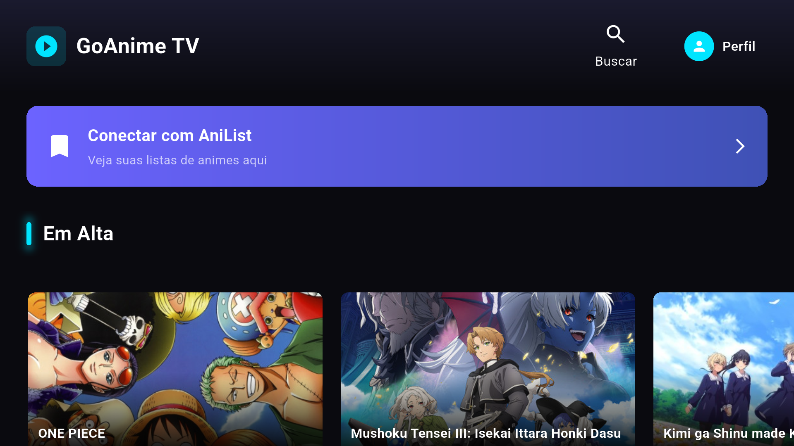
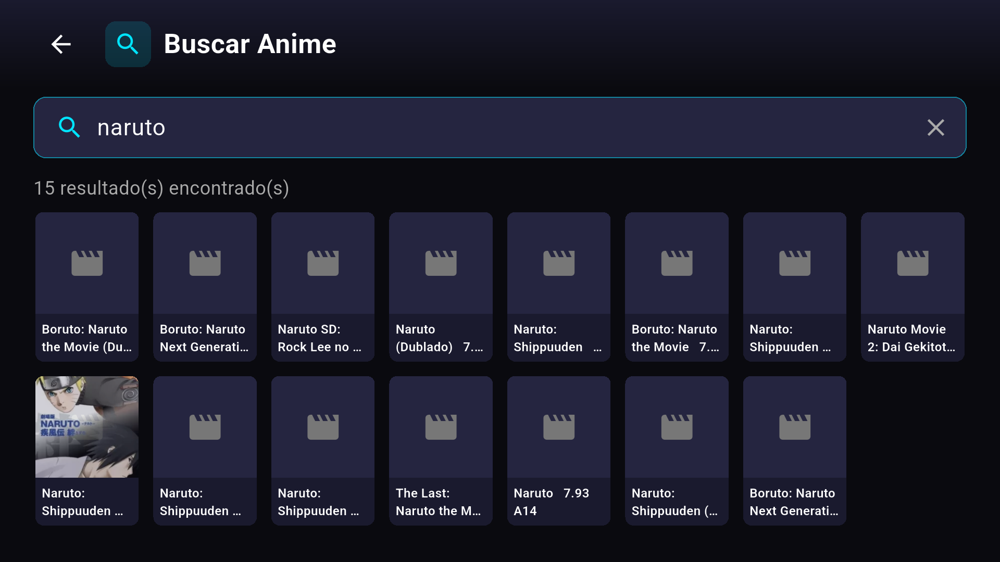
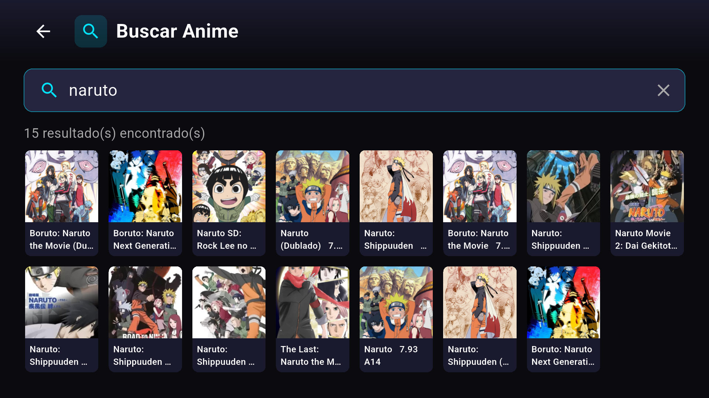
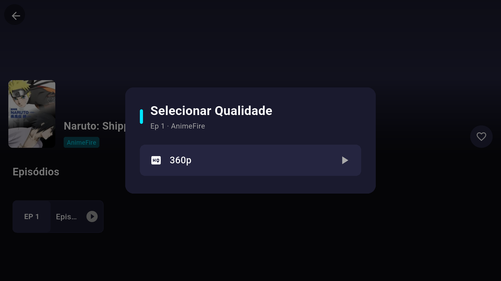
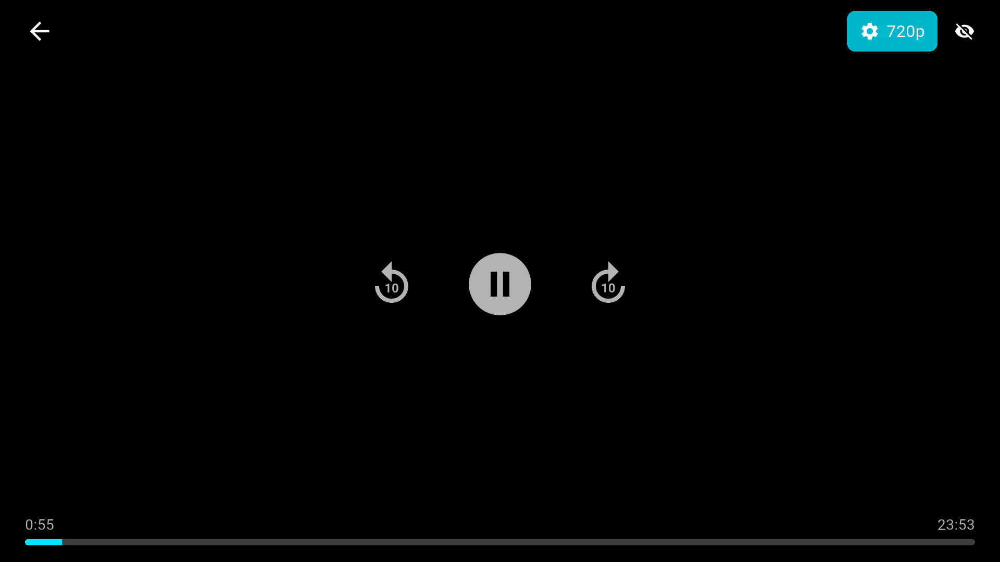

# GoAnime TV 📺

**GoAnime TV** é um aplicativo de streaming de animes para **Android TV**, focando na experiência de navegação por controle remoto (setas, não toque).

Nascido de um projeto de estudo (*vibe coding*), cresceu de um protótipo de scraping para um app funcional com player, busca, favoritos e integração com AniList — tudo sem nenhuma servidor próprio, consumindo os provedores web existentes.

> ⚡ *Vibecoded:* o app foi desenvolvido em modo vibe coding — iterando rápido, em conversa com IA, sobre GL com os prints do emulador. Está crudo em alguns cantos, mas é real e tava funcionando de verdade.

## Ideia

- **Sem backend próprio.** O app é um agregador de fontes públicas de anime em PT-BR (AnimeFire, Goyabu, DooPlay/AnimesROLL/BetterAnime/AnimePlayer). Faz *scraping* de HTML e consome APIs de player HLS direto.
- **Feito para TV.** Navegação 100% por D-pad/teclado, foco visual, sem depender de toque.
- **AniList integrado.** Login por QR code ou web, para puxar seu *Planejados* / *Watching* e que serve também de fonte de metadados (títulos, gêneros, notas).
- **Player embarcado.** Qualidade selecionável, controles próprios, tudo dentro do app.

## Features

- 🏠 **Home** com destaques e seção "Planejados" do AniList
- 🔍 **Busca** com resultados agregados entre múltiplas fontes
- 📺 **Player** de vídeo com seleção de qualidade e controles remoto-friendly
- ⭐ **Favoritos** e gerenciamento local de perfil
- 🎨 **Tema** escuro com destaques cyan/roxo
- 🌐 **AniList** login por QR code + sincronização de watchlist
- 👥 **Perfis** de usuário

## Screenshots

| Home | Busca | Detalhe |
|------|-------|---------|
|  |  |  |

| Qualidade | Player |
|-----------|--------|
|  |  |

## Stack

[Flutter] · [Dart] · [media_kit] (player HLS) · [AniList GraphQL API] · scraping via `http` + `html`

## Rodar

```bash
flutter pub get
# conectar um device/emulador Android TV
flutter run
```

> ⚠️ **Aviso legal:** o app consome conteúdo e links de terceiros; a disponibilidade das fontes muda sem aviso. Use por sua própria responsabilidade. Nenhum vídeo é hospedado pelo projeto.