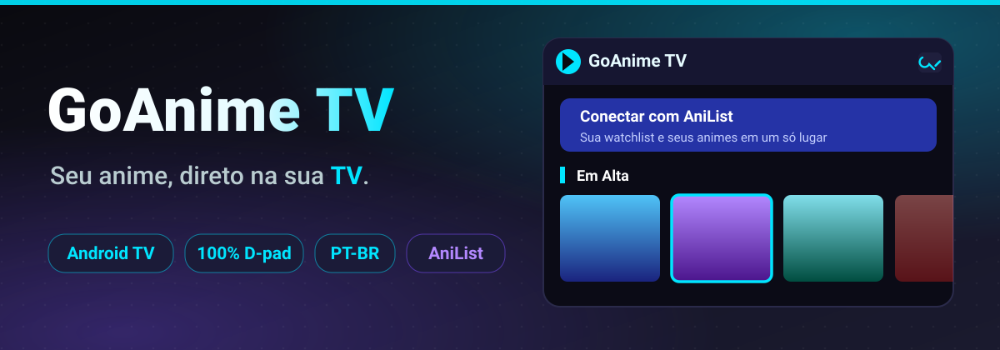

<p align="center">
  
</p>

<p align="center">
  
  
  
  
  
  
</p>

---

# 🎬 GoAnime TV

**O seu streaming de animes, feito para a sala de estar.**

GoAnime TV é um app de **Android TV** 100% navegável por **controle remoto** (D-pad, sem toque) que reúne as melhores fontes públicas de anime em **PT-BR** — dublado e legendado — numa interface única, bonita e rápida. Sem cadastro, sem mensalidade, sem enrolação: abriu, assistiu.

> 💡 Nasceu de um projeto de estudo e virou um app de verdade: player embarcado, busca agregada, watchlist do AniList, perfis e atualização automática — tudo **sem backend próprio**, consumindo as fontes web existentes.

---

## ✨ Por que GoAnime TV?

| | | |
| :- | :- | :- |
| 📺 **Feito para o sofá** | 🔍 **Busca multi-fonte** | ⚡ **Rápido e resiliente** |
| Navegação 100% por D-pad, foco visual e escala pensada para leitura a 3 metros. | Resultados agregados entre as principais fontes PT-BR de uma vez só. | Se uma fonte cair, o app tenta a próxima na hora — sem travar, sem tela branca. |
| 🎯 **AniList integrado** | ▶️ **Player embarcado** | 👥 **Perfis estilo Netflix** |
| Login por QR code, watchlist e metadados de títulos, gêneros e notas. | Qualidade selecionável (HLS/MP4 via media_kit), com retomada de onde parou. | Cada pessoa com seu perfil, favoritos e progresso separados. |

### Também incluído
- 🏠 **Home** com destaques e **"Continue assistindo"**
- ⭐ **Favoritos** e progresso por episódio (marcação de assistidos)
- ⏭️ **Pular abertura** (AniSkip) com auto-skip
- 🔄 **Auto-update** com changelog dentro do app
- 🗂️ Suporte a **animes em lançamento**: aviso de "episódio ainda não lançado" com data prevista
- 🎨 Tema escuro com destaques ciano/roxo

---

## 📸 Screenshots

<table>
  <tr>
    <td align="center"><br/><sub>Home</sub></td>
    <td align="center"><br/><sub>Busca</sub></td>
    <td align="center"><br/><sub>Detalhes</sub></td>
  </tr>
  <tr>
    <td align="center"><br/><sub>Fontes &amp; qualidade</sub></td>
    <td align="center"><br/><sub>Player</sub></td>
    <td></td>
  </tr>
</table>

---

## 📚 Fontes integradas

Agregador de fontes públicas de anime em português:

AnimeFire · Goyabu · BetterAnime · AnimesROLL · DooPlay · Animes Online (Cloud/Drive/AnimeQ/AnimePlay) · **Animes Online HDK** · **Animes Orion** · **AnimesHD** · AnimePlayer

> A disponibilidade das fontes muda sem aviso — o app lida com isso de forma resiliente, priorizando as mais rápidas e estáveis.

---

## 🛠️ Stack

| Camada | Tecnologia |
| :-- | :-- |
| App | [Flutter](https://flutter.dev) / [Dart](https://dart.dev) |
| Player | [media_kit](https://pub.dev/packages/media_kit) (HLS/M3U8 e MP4) |
| Metadados & watchlist | [AniList GraphQL API](https://anilist.gitbook.io/anilist-apiv2-docs) |
| Scraping | `http` + `html` (parsing client-side, sem servidor) |

---

## 🚀 Rodando

```bash
flutter pub get
# conecte um dispositivo/emulador Android TV
flutter run
```

---

## ⚠️ Aviso legal

O app consome conteúdo e links de terceiros; **nenhum vídeo é hospedado por este projeto**. A disponibilidade das fontes muda sem aviso e o uso é por sua própria responsabilidade. Respeite os termos de uso dos sites e as leis de direitos autorais do seu país.
